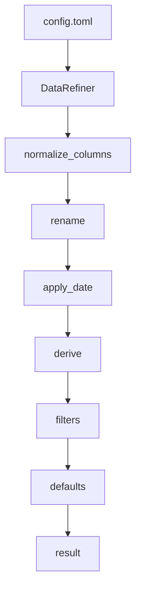

## Overview

A config-driven ETL preprocessing core module built on Polars LazyFrame. This project provides a
flexible and extensible data processing pipeline without requiring code changes.

---

## Features

- Preprocessing pipeline (normalization, transformation, filtering, default injection)
- Config-driven transformation logic (no code changes required)
- Dispatcher pattern for extensible operations
- State management (job lifecycle, checkpoint, lock control)
- Efficient large-scale data processing with Polars LazyFrame

---

## Design

- Pipeline-based architecture
- Config-driven transformations
- Dispatcher pattern for extensibility
- Separation of concerns

---

## Example

```bash
python main.py input.csv config.toml
```

Example configuration:

```toml
[test]

[[test.derive]]
op = "compare"
src = "amount"
op_type = ">"
val = 500
dst = "flag"
```

---

## Architecture

The pipeline is fully config-driven, and each transformation step is modular and extensible.



## Performance

Measured using repeated runs with `time.perf_counter`.

| Rows    | Time      |
| ------- | --------- |
| 1,000   | \~0.0001s |
| 10,000  | \~0.0001s |
| 100,000 | \~0.0003s |

- Execution time remains nearly constant due to vectorized processing
- Benchmark averaged over multiple runs
- Performance may vary depending on workload and environment

## Why This Project

This project demonstrates:

Ability to design extensible data processing architectures Strong abstraction and separation of
concerns Practical experience with scalable data pipelines Applying design patterns (Dispatcher,
pipeline architecture)
