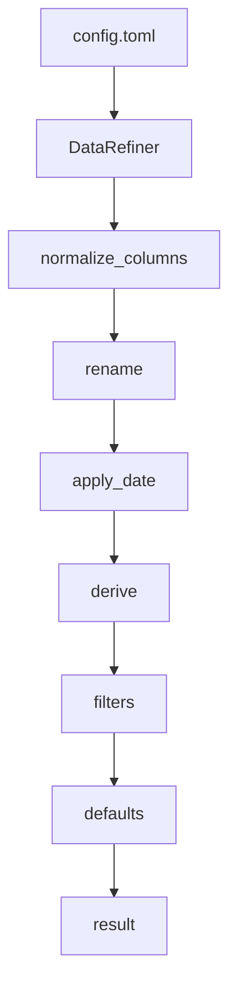

## Overview

PolarsのLazyFrameを基盤とした、\
**設定ファイル（config）主導のETL前処理コアモジュール**

コードを変更することなく、柔軟で拡張可能なデータ処理パイプラインを提供する

---

## Features

- 前処理パイプライン（正規化、変換、フィルタリング、デフォルト値の補完）
- 設定ファイルによる変換ロジック（コード変更不要）
- Dispatcherパターンによる拡張性の高い処理
- 状態管理（ジョブライフサイクル、チェックポイント、ロック制御）
- Polars LazyFrameによる大規模データの高速処理

---

## Design

- パイプラインベースのアーキテクチャ
- 設定ファイル主導の変換
- 拡張性を高めるDispatcherパターン
- 関心の分離（Separation of Concerns）

---

## Example

```bash
python main.py input.csv config.toml
```

設定ファイル例：

```toml
[test]

[[test.derive]]
op = "compare"
src = "amount"
op_type = ">"
val = 500
dst = "flag"
```

---

## Architecture

パイプラインは完全に設定ファイルベースで動作し、\
各処理ステップはモジュール化されており拡張可能



---

## Performance

`time.perf_counter` を用いて複数回実行の平均を測定した

| Rows    | Time      |
| ------- | --------- |
| 1,000   | \~0.0001s |
| 10,000  | \~0.0001s |
| 100,000 | \~0.0003s |

---

## Why This Project

このプロジェクトは以下を示すことが目的である：

- 拡張可能なデータ処理アーキテクチャの設計能力
- 抽象化と関心の分離の徹底
- スケーラブルなデータパイプライン開発の実践経験
- デザインパターンの適用（Dispatcher、パイプライン構造）

---
